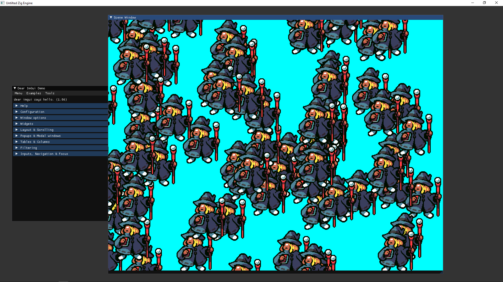

# Description

Prototype 2d oriented game engine, featuring automatic atlas baking and various experimentations in sprite rendering.
Used by me as a playground for the zig language.

Uses mach-glfw bindings for glfw
Zig-opengl for opengl bindings
Zigimg for image loading/saving
imgui for the debug ui
stb_rect_pack for the atlas packing

# How to build

* Run `zig build run-asset` to build the game assets
* Run `zig build run` to run the engine

(note : it seems that the latest zig release broke the mach-glfw bindings. For reference I'm using `0.10.0-dev.929+91a88a789`)
